# VisoMaster-Fusion (VMF)

This help is based on the build a20b1e6 of the dev branch of Visomaster-Fusion (https://github.com/Elricfae/VisoMaster-Fusion). From now on, VisoMaster-Fusion will be referred to as "VMF". Your version and so the features present can differ. Note that a small help is already present in the software for every feature. You must hover your mouse over a feature name to get a description for it.

Also note that there is no "better" or "perfect" way to use Visomaster. I'm just sharing my experience and tips. You will end up using the software differently than the next guy and that's fine.

---

## Summary

- [VisoMaster-Fusion (VMF)](#visomaster-fusion-vmf)
  - [Summary](#summary)
  - [First Launch](#first-launch)
    - [Panels interface](#panels-interface)
    - [Panel rearrangement](#panels-rearrangement)
    - [Top Bar Menu](#top-bar-menu)
  - [Media Panel](#media-panel)
    - [Filters](#filters)
  - [First Faceswap](#first-faceswap)
    - [Requirements](#requirements)
    - [Swap Faces](#swap-faces)
  - [Features deep dive](#features-deep-dive)
    - [Face swap](#face-swap)
      - [Swapper](#swapper)
      - [Swapper model](#swapper-model)
      - [Swapper Resolution - Inswapper only](#swapper-resolution---inswapper-only)
      - [Enable Auto Resolution - Inswapper Only](#enable-auto-resolution---inswapper-only)
      - [512 resolution - InStyleSwapper Only](#512-resolution---instyleswapper-only)
    - [Similarity Threshold](#similarity-threshold)
    - [Pre-swap sharpness](#pre-swap-sharpness)
    - [Swap Strenght and likeness](#swap-strenght-and-likeness)
      - [Strength](#strength)
      - [Face likeness](#face-likeness)
    - [Masks](#masks)
      - [Mask view selection](#mask-view-selection)
      - [Border Mask options](#border-mask-options)
      - [Profile angle mask](#profile-angle-mask)
      - [Occlusion mask](#occlusion-mask)
      - [DFL XSeg Mask](#dfl-xseg-mask)
      - [Xseg Mouth](#xseg-mouth)
    - [Text Masking](#text-masking)
    - [Original face Parsers](#original-face-parsers)
      - [Mouth Fit \& Align](#mouth-fit--align)
      - [Face Parser Mask](#face-parser-mask)
      - [Restore Eyes \& Restore Mouth](#restore-eyes--restore-mouth)
    - [Textures and colors](#textures-and-colors)
      - [Differencing](#differencing)
      - [Transfer Texture](#transfer-texture)
      - [Autocolor Transfer](#autocolor-transfer)
      - [Color Adjustments](#color-adjustments)
      - [JPEG Compression \& MPEG Compression](#jpeg-compression--mpeg-compression)
      - [Face Landmark Correction](#face-landmark-correction)
      - [Blend Adjustments](#blend-adjustments)
      - [Final Blend](#final-blend)
      - [Overall Mask Blend Amount](#overall-mask-blend-amount)
  - [Troubleshooting](#troubleshooting)
  - [Performance deep-dive](#performance-deep-dive)

---

## First Launch

### "Panels" interface

When you start VisoMaster, you can see that the software is organized in three main panel:

1. The Media Panel
2. The Faces Panel
3. The Parameters Panel

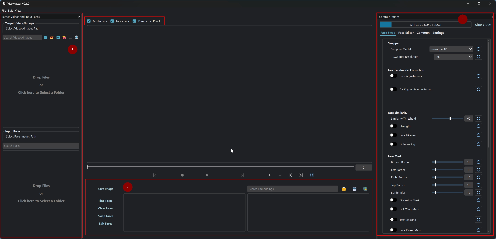

Each panel can be hidden by clicking on the buttons at the top of the program.

### Panels rearrangement

You can detach the media panel and the Parameters panel by clicking on this icon:

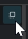

You can then play with the panels and place them how you want.

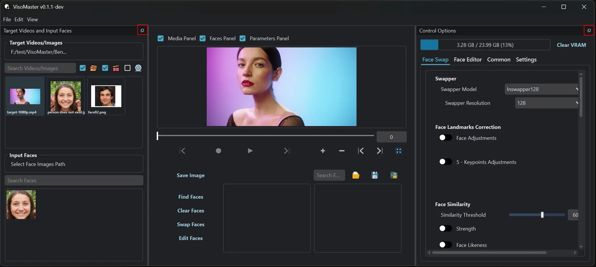

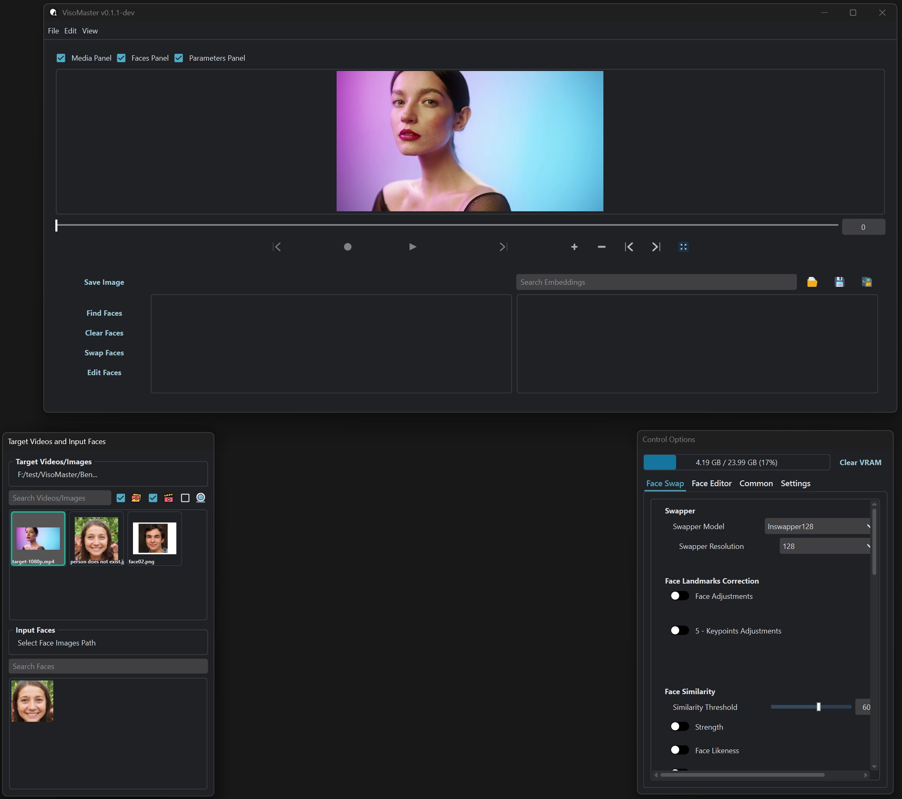

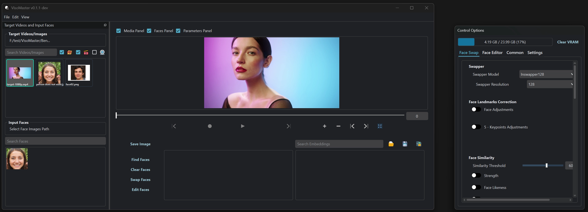

To reattach a detached panel to the media panel, double-click on the panel name at the top.

### Top bar menu

The top bar menu has different functions. Most of the options are on “File”.

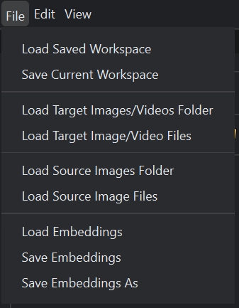

The “Workspace” is every options in the “Settings” tab configured in VisoMaster.

- Load Saved Workspace : Load a workspace you saved before
- Save Current Workspace : Save a workspace you’re satisfied with to work with it another time.

You need to also know that the workspace you used when you close VM can be opened during the next startup.

>[!TIP]
VMF will ask you if you want to open your last workspace (i.e, the workspace used when you closed VM). If you choose “OK”, the configuration will be loaded. If you choose “Cancel”, then you get a blank workspace to work with.

---

- Load Target Images/Videos Folder: Choose a folder (made of video / images) to work with on VM.
- Load Target Image/Video Files: Choose a file (image/video) to work with on VM.

---

- Load Source Images Folder: Choose a folder where your source/input faces are located (the face(s) that you want to use on your target image/video).
- Load Source Image Files: Choose one or multiples files as source/input faces.

---

- Load Embeddings: Load a JSON file where you saved your embeddings files.
- Save Embeddings: If you already opened an embedding json file, this act as a “Save” button. If no embedding file has been opened, this will act as a “Save as” button.
- Save embeddings As : Save as action.

An embeddings file contains one or more embedding target faces. An embedding is the merge of multiples face to create a embedded target face to be used for a face swap. An embedded target face can increase the likeness of the face you will use in comparison to a single image.

- The merge type to create the embeddings can be ‘Mean’ or ‘Median’.
- You can use as many faces as you want but more than 5-6 faces for a mean merge embedding won’t increase the likeness anymore.
- The mean type is better used to increase the likeness. The median type can have positive result if you have a lot more faces to put to the merge. There is no "better way", try it and make your choice.

## Media Panel

The media panel is used to manage your source video and input faces. You can select a folder or file(s) from the top menu or directly from the media panel when no media are yet loaded.

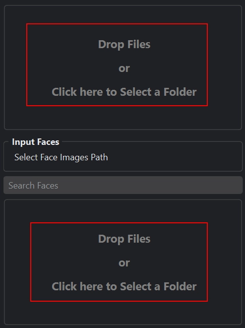

Once a target video / image and or input face has been loaded, this message disappear.

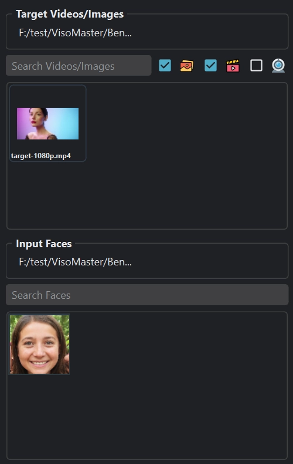

To change the folder / file on both of these options, you can then use the top menu to select a folder or drop one or multiple files inside one of the two boxes to **add** to the selection.

Using the top menu will reset the selection by the one you select (a folder or a file).

Dropping one or multiple files will add to the current selection.

You can mix a folder and additional files in each of these boxes.

### Filters

**Filter by media type**

On the media panel, you can filter in/out images/videos and webcam to be able to select them from your selected folder (including the individual files you also added by dropping them in the box).

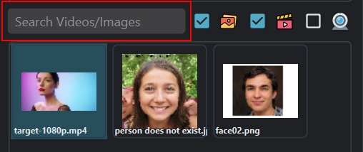
> [!CAUTION]
No wildcard support

## First Faceswap

### Requirements

Before trying a faceswap, there are few options that you need to configure:

- General - Go to “Settings” - General and configure the two options.
    - If your GPU doesn’t support TensorRT, choose CUDA.
    - If your GPU support TensorRT, I would recommend TensorRT-Engine in most cases.
    - If CUDA or TensorRT doesn’t work, you still have the CPU option but it’s not gonna work well…
    - For the number of Threads, if you can use TensorRT, select 5 threads. In case VRAM gets full, lower the number.
    - If your vram gets full and you’re stuck with cuda, keep the number of threads to 1 and increase it 1 by 1 while checking your vRAM usage. If it goes above 90%, lower the number.
      - You may need to restart VMF if your VRAM is full.

- Swapper Model
    - To begin with, make sure that “Inswapper128” is selected in the Face Swap tab.
    - Resolution doesn’t really matter for now, keep it per default.
- Target Video
    - Make sure that you imported at least one video with a face in it to do a faceswap.
- Input Face
    - One or more input face should be available. The input face will be used for the face swap to switch the face in the video with the face that you selected in the input face.
- Output Directory
    - To be able to save the video with the faceswap, you need to select an output directory. To do that, head over to the “Settings” tab.

Once these options are selected, you’re ready for your first faceswap.

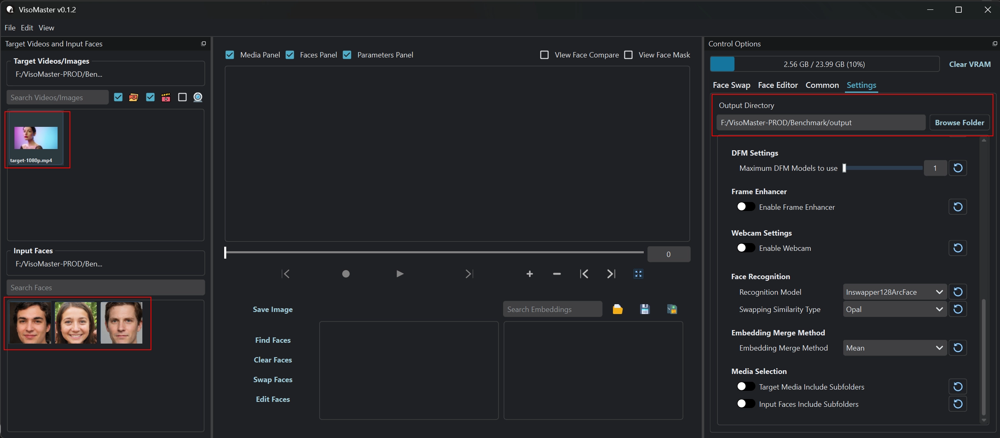

### Swap Faces

1. Select one of your video in Target Videos in the Media Panel. The video will appear in the middle of VisoMaster.
2. Select an input face. You can see a discrete green shadow on the face once it’s selected.
3. Scroll through the video until your find a frame with the face you want to swap. The face should be well visible, looking straight ahead and not too close or too far.
4. Click on “Find Face”.

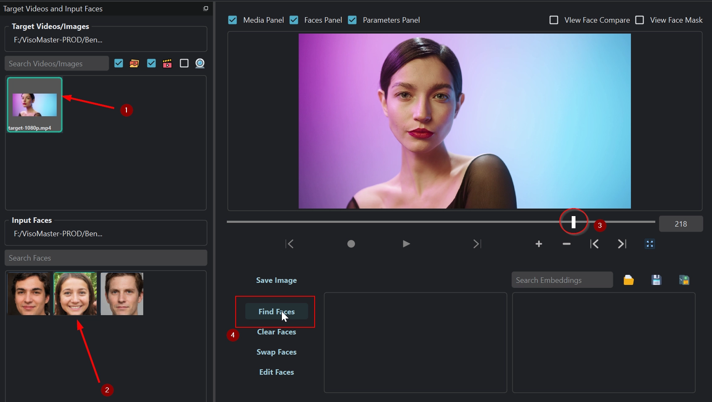

The face will appear on the “Faces Panel”.

1. You may have to click again the the input face.
2. Click on “Swap Faces”.

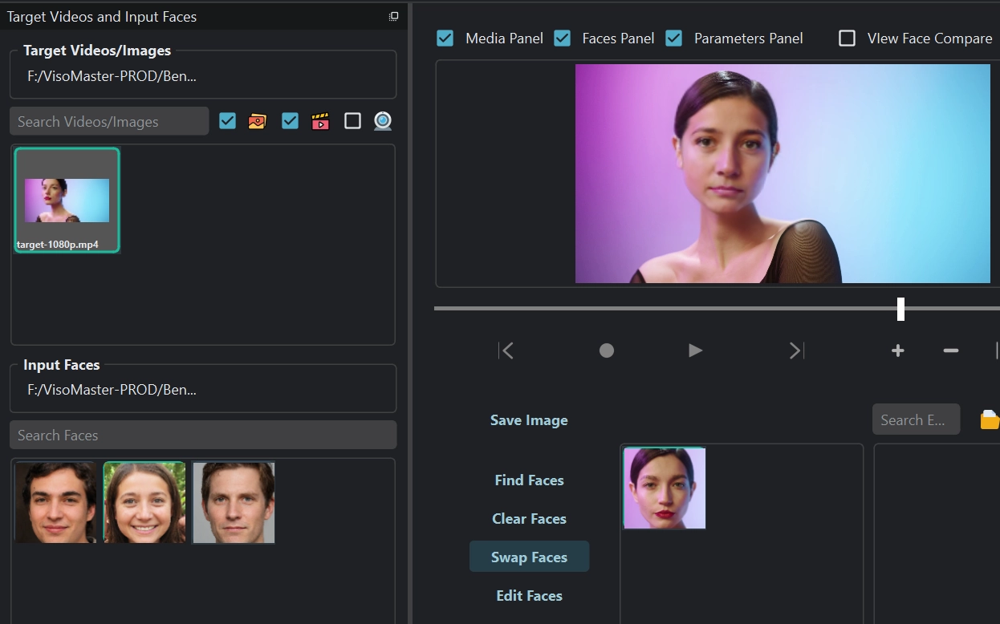

Once you understand these few steps, the rest is about making the faceswap “better” and adapt it to your specific videos.

## Features deep dive

### Face swap

All the features in "face swap" are per face. If you swap multiple faces, you need to click on the face for which you want to change an option before changing options in the "face swap" tab.

#### Swapper

#### Swapper model

The swapper model is the main feature used for face swapping. It's the most important and first choice to make. There are several choices in VMF.

The most used and still the better one in most cases is Inswapper. InStyleSwapper A / C can sometimes provide better alternatives.

Swapper models consume different compute power.

After trying to alternate between these three for a while, I just stick with Inswapper now.

- DeepFaceLive (DFM): Give you the ability to use DFL Models inside VisoMaster. It uses .dfm files. These files aren’t made available in VisoMaster. You’ll have to find them yourself. You can also train your own models to faceswap a specific face. It can requires weeks of work to achieve a good result with a model creation. To use the feature, simply place your .dfm files inside “VisoMaster-Fusion\model_assets\dfm_models” and select the option to have a list of usable model.

    - The “AMP Morph Factor” is specific to this type of model. If you need to use it, you know why.
    - “RCT Color Transfer” will basically blend color from the destination face to the input face so that the face don’t look “out of place” in the target video.

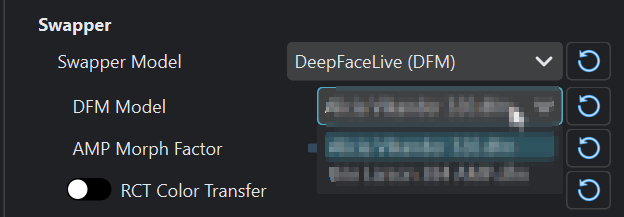

VMF doesn't support all the DFM models. You will need to convert some model to be able to use them in VMF.

>[!TIP]
Using DFL Models in VisoMaster requires the use of xSEG to blend with the target video nicely. Also note that changing xSEG Mask Size generally produce bad result with this type of model.

#### Swapper Resolution - Inswapper only

Models use a defined resolution. Specifically, for inswapper, it's possible to change the swapper resolution. It doesn't switch the model per se but provide a better output resolution. It provides better results at the cost of computing time.

**An example:**

Stick to 128 if you have a mid-range computer (and GPU) and that speed is important for you. 256 has the best balance between quality and compute time.

#### Enable Auto Resolution - Inswapper Only

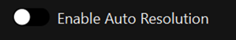

If you want to let VMF select the best resolution for you, you can enable this option. I let this option on off because I find that VMF make bad decisions quite often and make my render slow for no reason. Also, I just use 256 resolution 99% of the time.

#### 512 resolution - InStyleSwapper Only
Unlike Inswapper, Instyle is at 256 resolution per default. This option output it at a 512 resolution for a better quality. It will take a lot more compute power so be careful.

---

### Similarity Threshold
This threshold lets you play with how similar the input face should be from the found (target) face from the video you are using. The higher it is, the more identical the two faces must be. Play with the threshold if VMF doesn't swap your face because it's not detected. It can happen depending on the angle, where the face is located on the video, if it's too far away or too close to the camera. Stick with the default value unless you need to change it. If you are swapping two faces on the same video, play with this value on each face to make sure to have the correct face swapped at all time.

---

### Pre-swap sharpness
It will add sharpness to faces prior to the swap. Adding sharpness can over sharpen the result. A lot of features in VMF will add sharpening to the swap. Be mindful before changing the default configuration. I personally put this to 0.7 because of all the other features I use. It prevents over sharpening.

---

### Swap Strenght and likeness

#### Strength
This feature tries to strengthen the result by adding swapping iteration. I don't use this feature. If you do, be careful because the more you add value, the more it can shift part of the face compared to the find face. The nose, mouth etc. can become misaligned, especially with features like face expression or xseg/xseg mouth.

#### Face likeness
The goal is the same with a different technical implementation. Normalize Likeness prevents the face to shift to much when adding likeness. If you want to use face likeness, I recommend always leaving the "normalize" feature on.

---

### Masks

#### Mask view selection

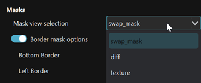

This feature is used to select the type of mask which appear when you click on "Face Mask" at the top of the screen.

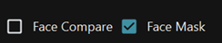

* **Swap mask**: Show the mask applied for the swapping.
* **Diff**: Show the mask applied by the "difference" feature.
* **Texture**: Show the mask applied by the "texture" feature.

Showing a mask can be useful to check where the effect of one of the above features are applied. See an example below with two swap masks with different 'Top Border' configurations:

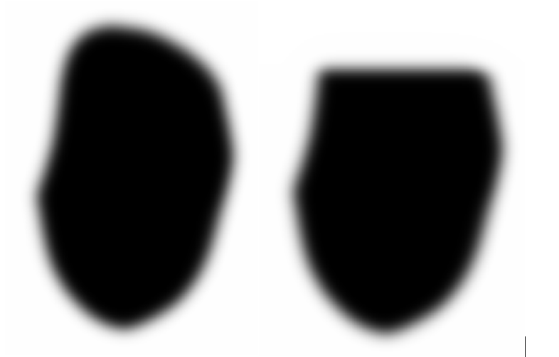

The second mask shows that the swap effect starts below the mask on the left because of the configuration. Above the mask, the original face will appear. It can be useful for example to keep some detail from the found face forehead even if they don't below to the swap face. It can increase "realism" in the final output video but decrease likeness to the input face.

#### Border Mask options
The 5 sub-options configure where the mask starts compared to the found face. If you want to keep some of the find face instead of the input face, you could have a high “top border” for example. You can show more or less the forehead of the find face like that. The same logic applies to the other options.

The “Border Blur” is useful to avoid having an overly visible demarcation between the input face and the found face (or the swapped face and the face in the target video) at the place where you placed the different borders.

**Example with the border blur at 0 and 10:**

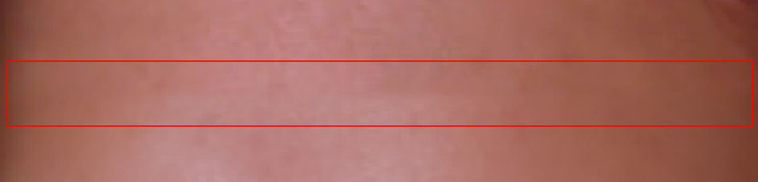
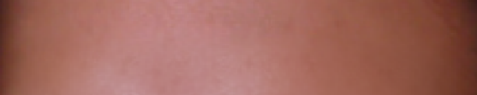

#### Profile angle mask

**As the explanation in VMF says:**

> Automatically fades the far side of the face when the head is turned (profile view) to hide distortions.

From my experience, the feature slightly enhances the face texture when the face is turned to the side. The effect is very light from my experience. The effect is light.

If you activate this feature, try it with this configuration: Angle Threshold 5, Fade Strength 100.

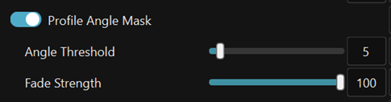

**See one example without and with the feature on:**

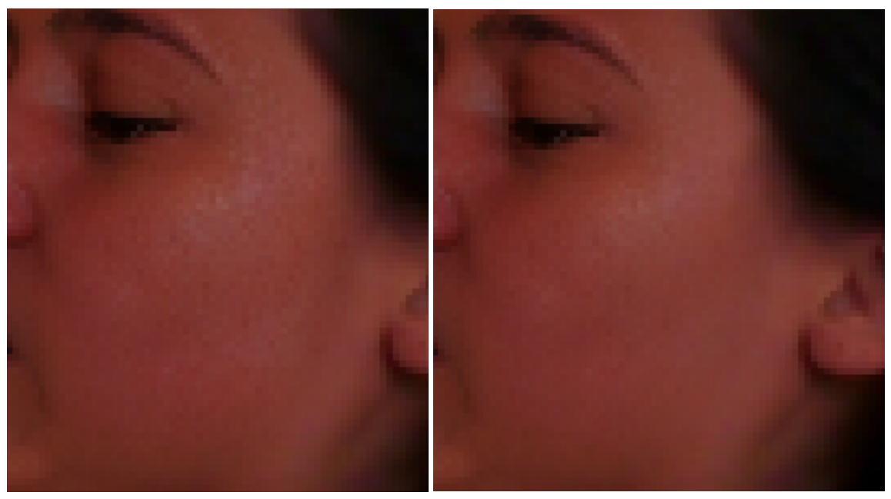

#### Occlusion mask
The occlusion mask is allowing object in front of the face to still appear after the swap. Without that, the swapped face will appear instead of objects which will pass in front of the face.

**Example with occlusion off and occlusion -25:**

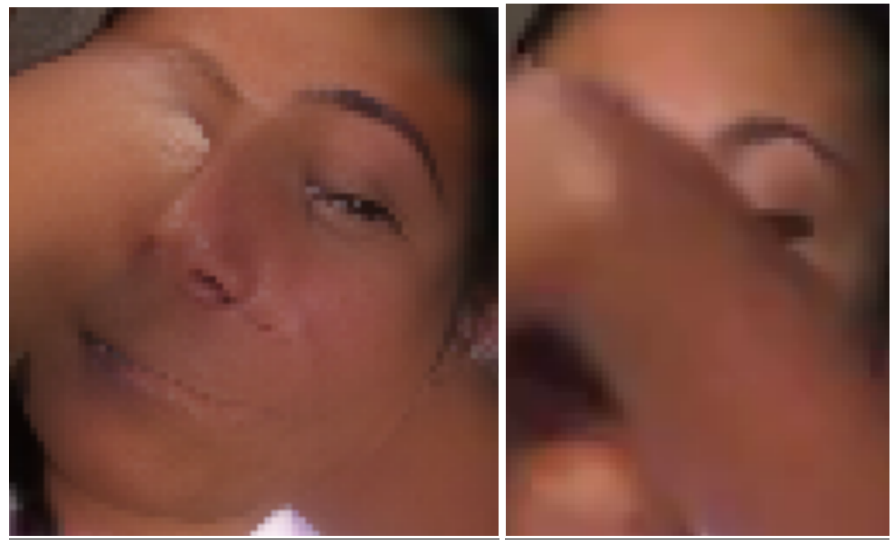

> [!NOTE]
> The occlusion mask feature is not needed most of the time with xseg because it is far superior in most cases. The occlusion mask can still be useful in very rare cases when xseg fail to let all the “objects” in front of the face to appear.

> [!TIP]
I only use occlusion with the specific cases explained above.

#### DFL XSeg Mask

See the explanation for the Occlusion Mask above. Xseg is superior. As written above, it may fail in some instances to occlude perfectly.

I will take the same example as before with :
-	No occlusion
-	Xseg only (-9)
-	Xseg (-9) + occlusion mask (-9).

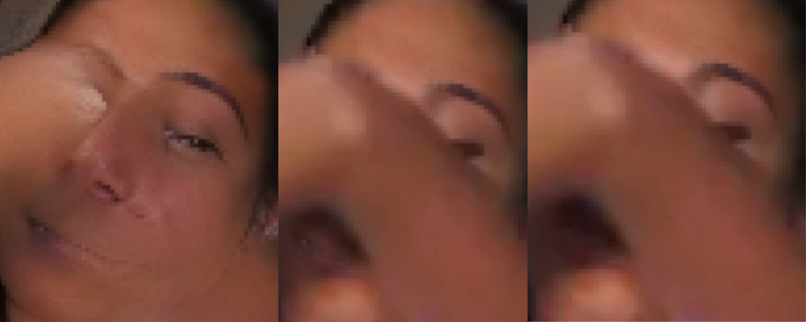

We can see that xseg alone is struggling. With some additional occlusion, the issue is fixed without having to go to a -25 configuration which will lead to other issue.

No that this is a very specific example but generally xseg is doing a way better job than occlusion.

> [!TIP]
I would recommend to use xseg around between -2 and -5 with occlusion mask off in general. Activate occlusion only when needed. It's also better to add some blur to smooth out the result.

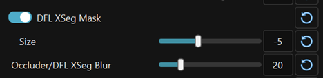

> [!CAUTION]
Regarding positive value for xseg, I would avoid it most of the time. Here is the result with xseg in a +5 value and the same occlusion mask value as before:

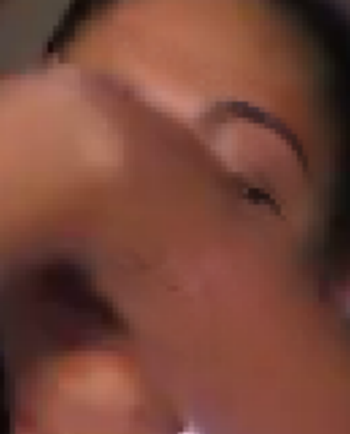

The occlusion is done incorrectly.

> [!TIP]
The use case where I would use it is for side view where you want to restore the nose (and part of the eyes) properly.

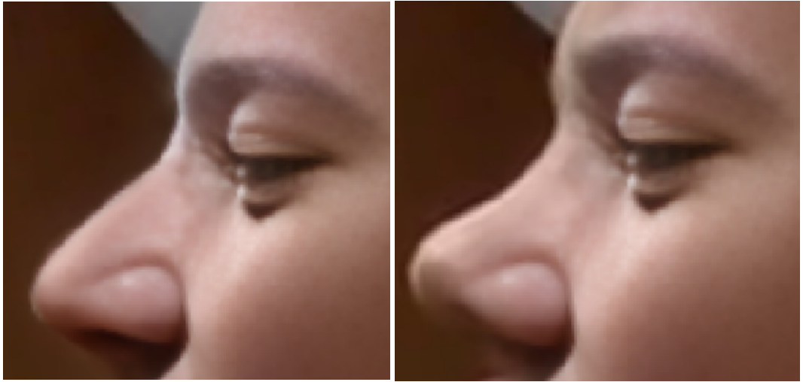

xseg +5 / xseg -5

On the first case we have a correct nose from the input face.

On the other case we have part of the find face nose. This is a pretty rare case where xseg is better at a positive value.

Up-to-you to see if you want to bother changing the option all the time when needed. I just keep xseg at a negative value, I find that this configuration has more advantage than the contrary.

#### Occluder / xSEG Blur

> [!TIP]
I would recommend a value of 15/20. The default value (0) is rough on the xseg mask. See below with 0 and 15 value.

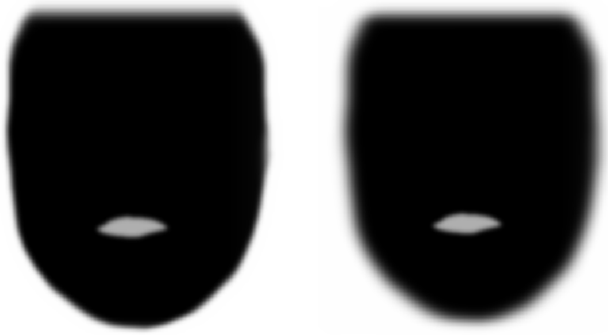

#### Xseg Mouth

Use xSEG specifically on the mouth part.  It’s useful to replace part of the input face mouth with the find face mouth.

With the current VMF version, I don’t really like the “v-shape” mask applied with xseg, so I mainly use it in conjunction with face expression restorer.

**“v-shape” mask for xseg mouth:**

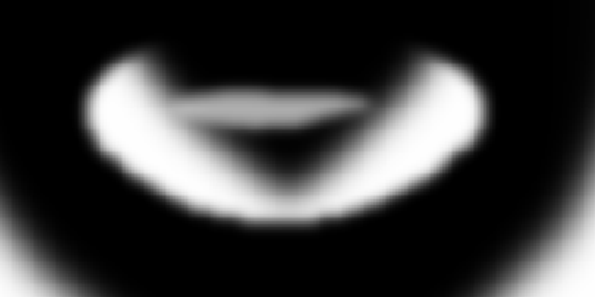

> [!TIP]
I use the following values, and I activate it when needed to complement the expression restorer:

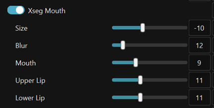

> [!CAUTION]
If you’re not using the expression restorer feature - Keep in mind that it's very heavy on the GPU - xseg mouth may required a more negative value to have a visible effect. Configuring the higher upper/lower lip values is also important to have a bigger effect. Unfortunately, I found the v-shape mask hard to use to have a proper result without replacing the entire mouth…

The rest of the options are self-explanatory. Don’t reduce the Blur too much or the effect won’t be natural.

---

### Text Masking

Text masking is used to occlude a specific element by typing a word (teeth, tongue, hand, etc.). It’s hard to use because which words are really working well is unknown. Also, the value for it to work may require a high value which begins to occlude way more than the intended word. Tongue for example will start replacing the entire mouth and more at higher value.

The feature only works after you type a word a press “enter”.

> [!TIP]
I barely use it but sometimes when someone is singing or with specific tongue movement, text masking can help occlude it correctly if xseg isn't enough. For most cases, don’t go above 40 or it will start occluding too much of the face outside of the word chosen.

---

### Original face Parsers

#### Mouth Fit & Align

Try to align the original mouth to the swap. It can be used without the below face parser option.

This feature is experimental.

**Some comparisons:**

Original / Swap / With fit & align.

> [!TIP]
I don’t use this feature often but on newer version the effect looks better and more stable than before.

#### Face Parser Mask
The main feature here is to replace a specific part of the face with the original one. Basically, it prevents the swap. The effect is strong and for most options, anything at 1 will be ‘unswapped’. Any stronger value will make the mask around the selected part bigger and show more of the original face around the selected area. For example, nose at 1 and nose a 15.

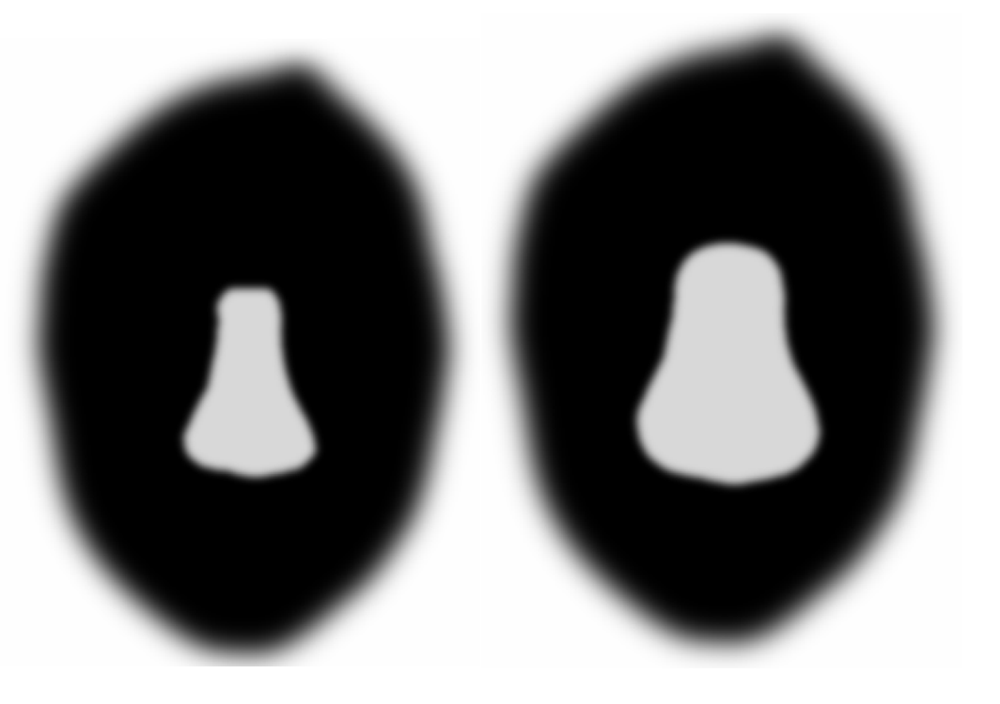

Nose at 1 / Nose at 15

> [!TIP]
I generally don’t use it as the effects are too strong. I only keep it on with hair = 1/2 because xseg can struggle when hair is in front of the face. Mouth is also kept at 1 as it will prevent the inside of the swap mouth to look like a pixel soup. I keep "face blend" at 15 so the transition between the original face/swap face is smooth.

##### Parse at Pipeline End

I have no use case for this feature.

##### Mouth Inside Toggle

It will prevent the original inside of the mouth (when using the ‘mouth’ option) to overflow. Basically, it will prevent the original mouth to take over and keep it in check. As you can see on the image without the option, the lips are being replaced in addition to the inside of the mouth (or the “teeth” here).

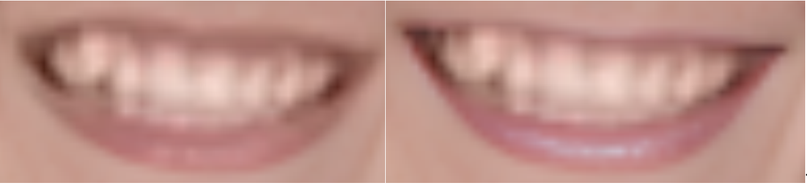

Face parser mouth ‘Mouth’ at 15 without and with the 'mouth inside' option on.

#### Restore Eyes & Restore Mouth

Both options are used to restore the original eyes and mouth. I have no advice as I never used these options.

---

### Textures and colors

#### Differencing
Differencing is smoothing out the difference between the input faces and the find face.

The more you push the setting, the more the input face will go towards the find face. It can help “blend” the swapped (input face) face better. You will then loose some of the similarity with the input face.

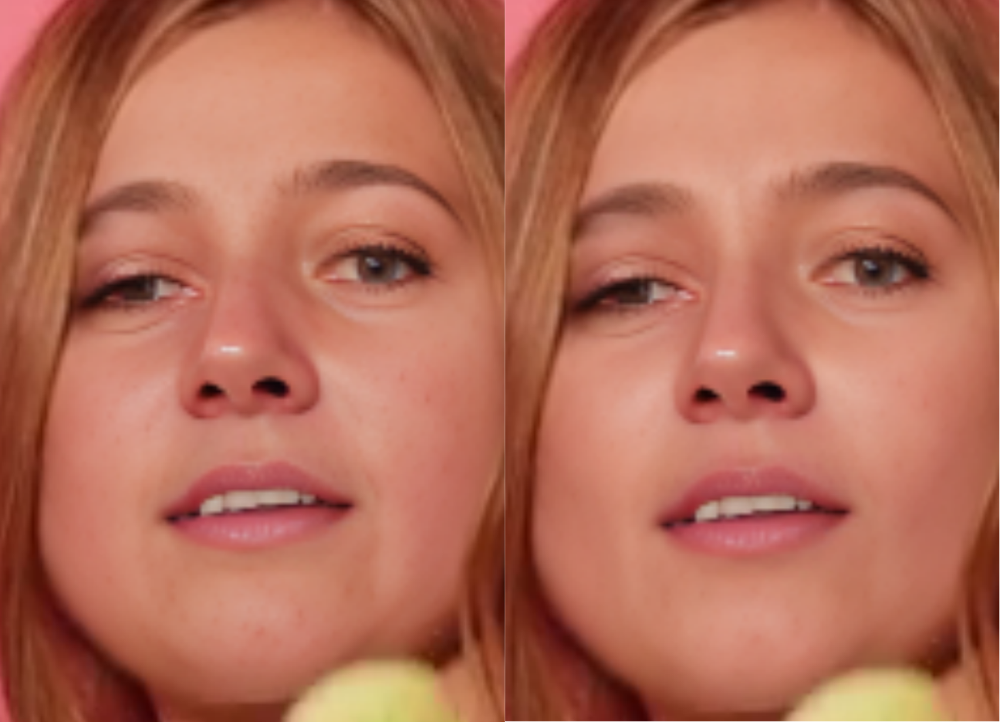

> [!TIP]
I don’t have best practices or use cases to share as I don’t use this feature alone. Can be use in conjunction with Texture transfer. See below.

#### Transfer Texture
Transfer texture is a great way to preserve better  skin details from the find face. It also works with liquid, tatoo etc. Don’t expect it to work all the time or to preserve small stuff. It can also preserve a texture or not from one frame to another. This must be closely looked at if you want to use it. It’s a great feature but it’s not perfect.

> [!CAUTION]
This feature has a bad blend between the “transferred texture” and the rest of the swap. The different “mask blend” or “blur” that you can configure at different point in VisoMaster don’t apply to this feature. Don’t use the face blend option with a too high value as it basically removes the transfer texture effect.

> [!WARNING]
This feature is changing on a regular basis. Results will vary from one version to another.

**Example:**

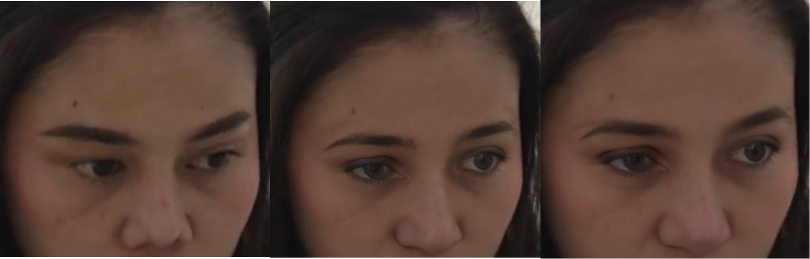

Original Face / SWAP with TT / Swap with TT & a strong differencing value

Texture transfer was able to recover the mole from the source face.
The third picture show the result with a high differencing value also applied. We can see the mole is less visible and the find face right eyebrow start to “leak” in the result.

If we apply a more reasonable value for differencing (like the default one), we can be able to preserve even better the find face skin detail.

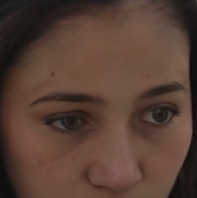

The mole is better preserved and the dark circles under the right eye is almost identical to the find face. The eyebrow isn’t leaking at all.

>[!TIP]
Here is the setting I use for texture transfer. Mind you, this is a strong configuration. It can show visible problems with the blend and have too much transfer texture at time.

>[!WARNING]
Do note that Texture transfer changed a couple versions ago and I'm not able to achieve this type of result in the current dev build.

>[!TIP]
Recommended configuration in the build listed at the beginning of this document

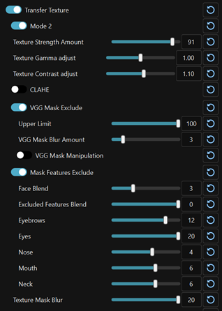
-	Mode 2: Disable it if the effect is too strong or if the skin texture has a cracked appearance.
-	As mention earlier, avoid Face blend above 3 as it reduce the effect of the transfer texture.

I won’t go into every detail of every option. It’s more a game of try and try again until you’re satisfied with the result.
From these settings, the most important is to play with the value on the “mask features exclude” as it grows or shrink the mask to recover the input face parts. Since the blend is not good, it can be useful to change the size of the mask to hide this problem.

For example, in the following picture, the mask on the mouth is clearly visible. On the second pic, the mask is bigger and for me less noticeable.

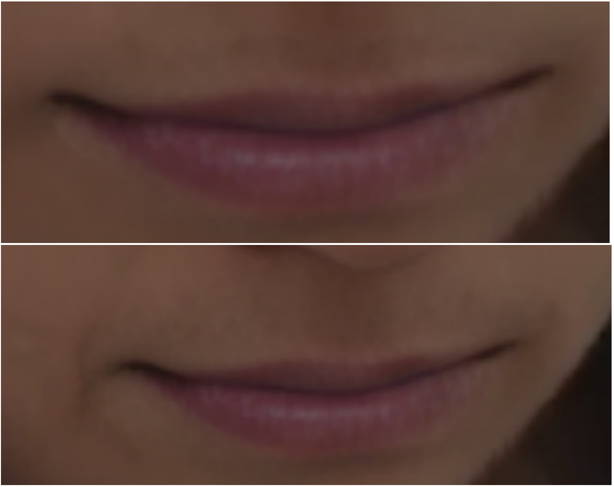

#### Autocolor Transfer

It’s adding an autocolor pass to the swap.

Few features now automatically apply this setting when they are on.
As a general practice, I activate it all the time and switch it off when I feel the colors are wrong, too strong or if the face become too bright.

>[!TIP]
**My settings**

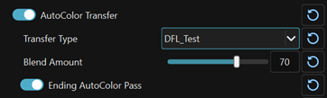

#### Color Adjustments
This feature can add colors or brightness, contrast, saturation etc. to the swap. I never use it so I have no advice.

#### JPEG Compression & MPEG Compression
These two features add different types of noise to the result. I don’t personally use it.

#### Face Landmark Correction
These features change the position of the face landmarks found by the detector (see landmark detection). They use different methods. I don’t use the features.

For the 5 keypoints adjustments, you can activate “show landmarks” to help you adjust the points.

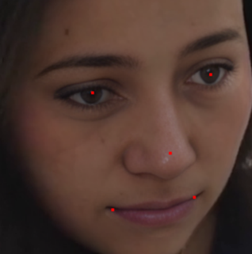

#### Blend Adjustments

#### Final Blend
The amount add a veil of blur to the result. It can help smooth out the result if it’s too “sharp”.

I activate it and leave it at “1” all the time.

#### Overall Mask Blend Amount

I configure it at 11. It helps hide the transition between the different masks.
Here is an example with 0 and 18 as values. I created a strong unrealistic mask for the sake of this example.

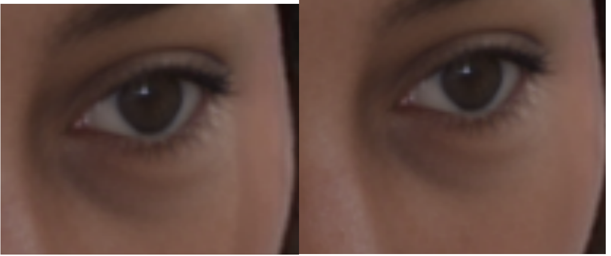

A mask too strong can hide effects of some of the features and create visual glitches like the following:

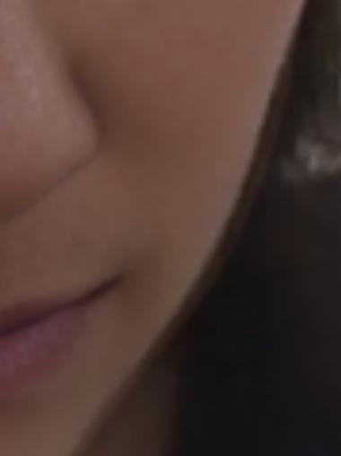

---

## Troubleshooting

**Can’t load one or more faces**

Check if you have this type of message:

[ WARN:0@68.046] global loadsave.cpp:241 cv::findDecoder imread_('F:/VisoMaster/Benchmark/face\t├®l├®lod.jpg'): can't open/read file: check file path/integrity

VMF won’t load files with unicode character in the filename (except digits). Make sure it’s not the case.

For information: https://en.wikipedia.org/wiki/List_of_Unicode_characters

**VisoMaster File extension support**

VisoMaster support the following file formats:

Images :  .jpg,.jpeg,.jpe,.png,.webp,.tif,.tiff,.jp2,.exr,.hdr,.ras,.pnm,.ppm,.pgm,.pbm,.pfm)

Videos : .mp4,.avi,.mkv,.mov,.wmv,.flv,.webm,.m4v,.3gp,.gif
